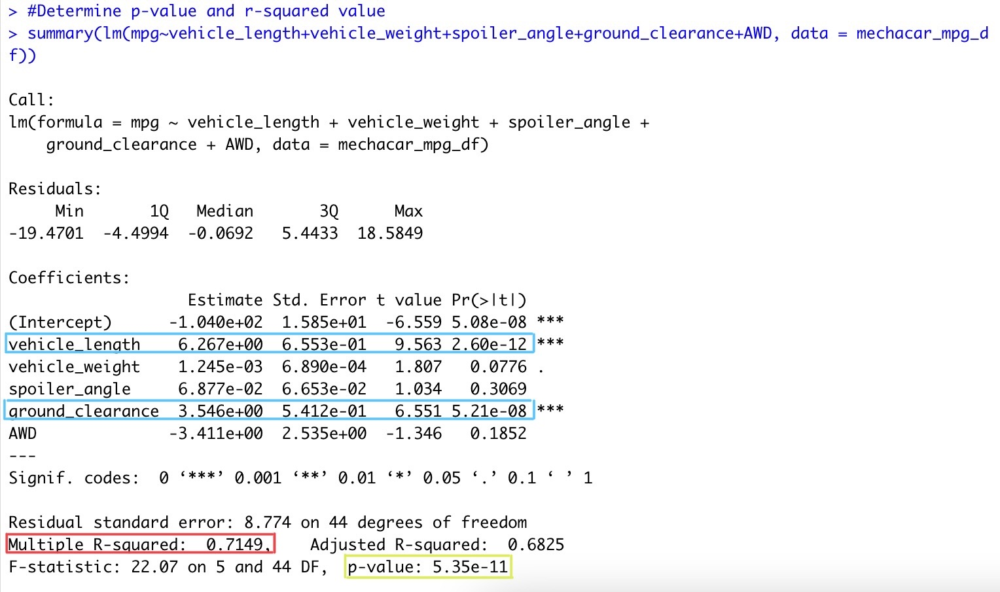
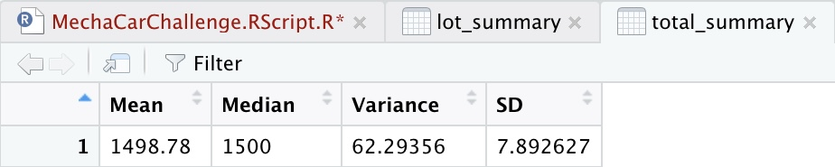
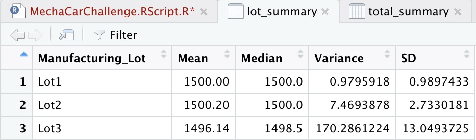
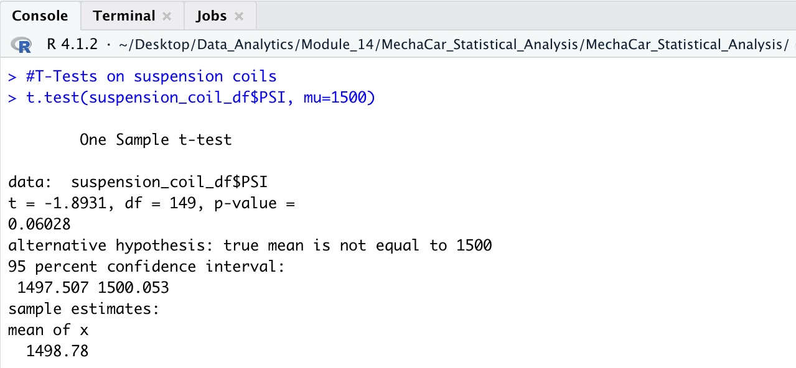

# MechaCar Statistical Analysis

## Linear Regression to Predict MPG

- The variables in our dataset which show a non-random effect on the MPG of the MechaCar are the Vehicle Length and the Ground Clearance (circled in blue above).

- The slope of the linear model is can't be considered zero because the p-value of 5.35e-11 (circled in green above) is much lower than an extreme level of significance, indicating the relationship between the variables and miles per gallon is conditional to more than random chance.

- Yes, this linear model does predict mpg of MechaCar prototypes somewhat effeectively because the r-square value of 0.7149 (circled in red above) indicates a 71% accuracy. 

## Summary Statistics on Suspension Coils

- On the Total Summary Table above we see the overall variance is under 100 PSI, meeting the specifications. However, in the Lot Summary Table we see that Lot 3 has a variance of 170.28 PSI, putting Lot 3 well over the acceptable specifications. 

## T-Tests on Suspension Coils
- The results of the T-Test for the suspension coils across all manufacturing lots show no statistical difference from the population mean and the P-Value (0.06028) is not low enough to reject the null hypothesis. 

- The results of the T-Test for the suspension coils for Lot 1 show no statistical difference from the population mean and the P-Value (1) is not low enough to reject the null hypothesis. 

- The results of the T-Test for the suspension coils for Lot 2 show no statistical difference from the population mean and the P-Value (0.6072) is not low enough to reject the null hypothesis.

- The results of the T-Test for the suspension coils for Lot 3 show there is a small statistical difference from the population mean and the P-Value (0.04168) is just low enough to reject the null hypothesis. 

## Study Design: MechaCar vs Competition
- There are many factors that consumers take into consideration when evaluating a car to purchase. Considering inflation and the high costs of living at the moment, a consumer will be looking to buy a car that is economical in terms of cost, fuel efficiency, maintenance costs and long-term reliability.

- Metrics to Test: 
  MechaCar's maintenance costs for the most frequent maintenance such as oil and tire change/rotation compared to other competitor's vehicles. 

- Null and Alternative Hypothesis: 
  H0: MechaCar prototypes' average maintenance cost is similar to competitor vehicles in the same vehicle class. 
  Ha: MechaCar prototypes' average maintenance cost is above or below that of competitor vehicles. 
  
- Statistical Test Used: 
  The best statistical test would be a two-sample T-Test.

- What Data is Needed:
  We would need to gather the average maintenance cost for all MechaCar prototypes as well as the average maintenance cost from all major competitor vehicles. 